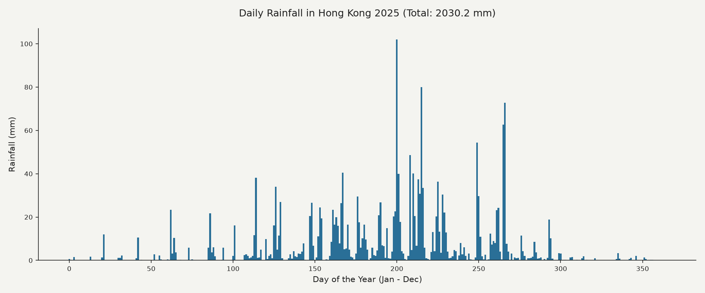

# kowloon-rainfall
# Kowloon Rainfall

## The Phenomenon
This project visualizes the daily rainfall in Hong Kong throughout the year 2025. Precipitation is a natural atmospheric phenomenon driven by monsoons, tropical cyclones, and seasonal weather fronts, fluctuating dramatically between dry winters and wet summers. Understanding these patterns is crucial for urban planning and weather forecasting in the region.

## The Source
The data comes from the Open-Meteo Archive API:
[Open-Meteo Historical Weather API](https://archive-api.open-meteo.com/v1/archive?latitude=22.32&longitude=114.17&start_date=2025-01-01&end_date=2025-12-31&daily=precipitation_sum)

The dataset contains daily meteorological rows, recording the date and total daily precipitation sum in millimeters (mm) for Hong Kong throughout the entire year.

## The Picture


## What the Picture Shows
The bar chart shows the daily distribution of rainfall across the entire year. Tall bars highlight heavy downpours during summer months, while periods of zero or low bars reflect the dry winter season. 

*What it hides:* Daily totals smooth out sub-daily intensity—a torrential 2-hour thunderstorm looks identical in total volume to steady all-day rain, masking short-duration extreme weather events.

## How to Run
```bash
uv run plot.py
---
*Note: Cleaned up and verified for final submission.*

